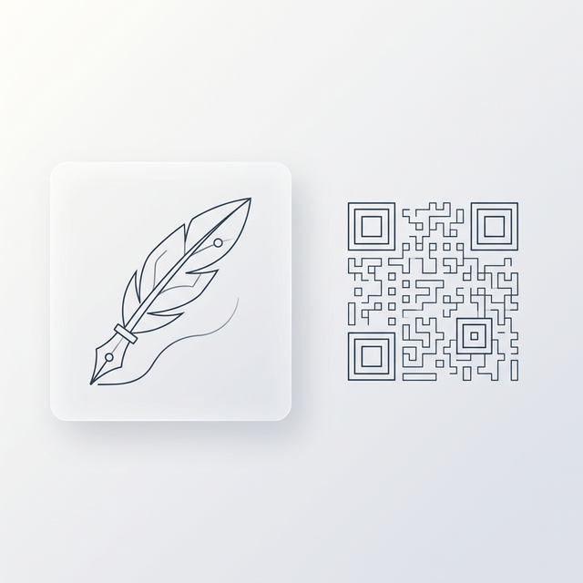

# EncQder

> A clean, minimal Flutter app for encoding and decoding QR codes — with offline history, system-adaptive theming, and a gesture-first interface.

*This project is **AI Vibe Coded**, built as a high-fidelity experiment to push the boundaries of [Antigravity](https://google.com) and assist with my personal utility workflows.*

## Why It Exists

EncQder was born from a need for a privacy-first, zero-friction QR tool that doesn't track you. It's a playground for premium Flutter UI patterns and a personal assistant for my daily digital organization.

## What It Does

EncQder gives you three core tools in one swipeable interface:

- **Create** — Type any text or URL to generate a QR code with an auto-incrementing label, then save it to your history.
- **Scan** — Point your camera at any QR code to read its content and add it to your local history.
- **History** — Browse entries with custom labels, view high-res QR renders, and access a **Smart Share Sheet** for native sharing or gallery saving.
- **Privacy-First** — All data is stored **locally on your device**. No network calls, no accounts, no tracking.

## Premium UX Features

- **Dynamic System Theming** — Seamlessly integrates with Android's Material You, inheriting OS-level dynamic colors while ensuring a consistent fallback to custom dark/light modes.
- **Focused Camera Scanning** — A distraction-free scanning experience that restricts the scan window to a central, themed cutout. 
- **Fluid Navigation** — A custom "sliding pill" bottom nav that interpolates position and style in real-time as you swipe between screens.
- **Smart Share Sheet** — An animated, blurred overlay with staggered action chips for one-tap sharing or saving to the device gallery.
- **Inline Renaming** — Keep your history organized by giving any QR code a custom label (e.g., "Home Wi-Fi", "Office Key").
- **Portrait Locked** — Optimized for a consistent, single-handed mobile experience.

## Getting Started

### Prerequisites

- [Flutter SDK](https://docs.flutter.dev/get-started/install) (3.x or later)
- Android device or emulator (iOS support included)
- For physical device testing: USB debugging enabled

### Run Locally

```bash
git clone https://github.com/your-username/encqder.git
cd encqder
flutter pub get
flutter run
```

## Project Structure

```
lib/
├── main.dart                  # App entry point, theme configuration
├── screens/
│   ├── home_screen.dart       # PageView shell + animated bottom nav
│   ├── input_screen.dart      # Text input → QR generation + save
│   ├── history_screen.dart    # Offline history list + detail modal
│   └── camera_screen.dart     # QR scanner with torch + camera controls
├── services/
│   └── storage_service.dart   # SharedPreferences wrapper for history
└── widgets/
    └── qr_display.dart        # Reusable QR rendering widget
```

## Key Dependencies

| Package | Purpose |
|---|---|
| `qr_flutter` | QR code rendering |
| `mobile_scanner` | Camera-based QR scanning |
| `shared_preferences` | Offline local storage |
| `dynamic_color` | Material You OS theming support |
| `intl` | Date/time formatting in history |

## Roadmap

See [ROADMAP.md](./ROADMAP.md) for what's been built and what's planned next.
